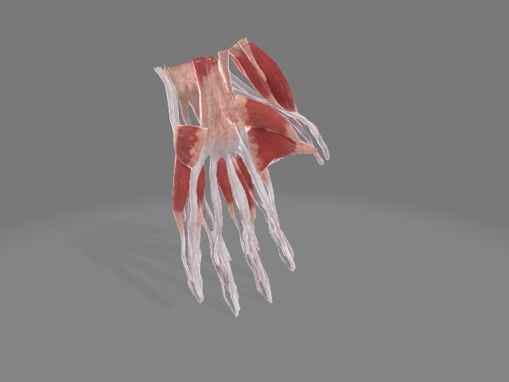

QR Tracking Unity and Show Virtual Hand Models for HoloLens 2 Using OpenXR
===

This repo is building on top of QR code tracking sample Unity project that displays the information and location of a QR code using HoloLens 2 and show the vitual models under the QR code detect area.

This sample Unity project is adapted from [chgatla-microsoft/QRTracking](https://github.com/chgatla-microsoft/QRTracking), and in addition applied [latest Unity 2020 and OpenXR Plugin for HoloLens 2](https://docs.microsoft.com/en-us/windows/mixed-reality/develop/unity/openxr-getting-started).

---

---

Models:

Muscle model:

Skeleton model:

Venous model:

